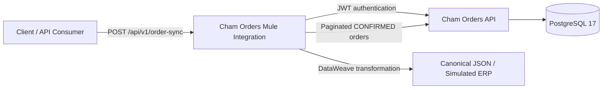

# ChamTech Software Engineering Portfolio

ChamTech is the personal software engineering portfolio and software laboratory of **Deivid Vanegas**.

It is not a company or commercial organization. It is an engineering ecosystem created to demonstrate backend development, enterprise integration, API design, automated testing, documentation and local deployment practices.

---

## Portfolio overview

This portfolio combines two complementary engineering tracks:

### Backend Engineering

- Java 21
- Spring Boot
- REST API design
- PostgreSQL
- Flyway
- Docker
- JWT authentication
- Automated testing
- OpenAPI documentation

### Enterprise Integration

- MuleSoft
- Mule Runtime 4
- APIKit
- RAML
- DataWeave
- HTTP integrations
- Pagination
- Correlation tracking
- Canonical data models
- MUnit testing

---

## End-to-end architecture

The portfolio demonstrates a complete local integration flow:

1. A client invokes the MuleSoft synchronization API.
2. Mule authenticates against the Java backend.
3. Mule retrieves confirmed orders using real pagination.
4. Correlation IDs are propagated across the integration.
5. DataWeave transforms the backend response into a canonical model.
6. The integration generates a JSON file representing delivery to a simulated downstream ERP.

---

# Projects

## 1. Cham Orders API

**Status:** Locally verified Release Candidate  
**Repository:** [github.com/Aslannt/cham-orders-api](https://github.com/Aslannt/cham-orders-api)

A production-style order management REST API built with Java 21, Spring Boot, PostgreSQL, Flyway, Docker and OpenAPI.

### Main capabilities

- JWT authentication.
- ADMIN and OPERATOR role authorization.
- Customer management.
- Product management.
- Multi-item order creation.
- Server-side monetary calculations.
- Historical product name, SKU and price snapshots.
- Controlled order status transitions.
- Pagination and filtering.
- Correlation ID propagation.
- Standardized HTTP error contracts.
- Request, domain and database monetary limits.
- OpenAPI JSON, YAML and Swagger UI.
- Docker Compose local environment.

### Verification

- 38 automated tests passed.
- Maven clean test passed.
- Maven clean package passed.
- Docker image built successfully.
- PostgreSQL 17.10 health check passed.
- Flyway V1 and V2 applied successfully.
- OpenAPI JSON returned HTTP 200.
- OpenAPI YAML returned HTTP 200.
- Swagger UI was accessible.
- Complete Docker-backed smoke test passed.
- Runtime 404, 405 and 415 contracts were verified.
- Clean-clone verification passed.

### Main technologies

`Java 21` · `Spring Boot` · `Spring Security` · `PostgreSQL` · `Flyway` · `Docker` · `Maven` · `JWT` · `OpenAPI`

---

## 2. Cham Orders Mule Integration

**Status:** Locally verified Release Candidate  
**Repository:** [github.com/Aslannt/cham-orders-mule-integration](https://github.com/Aslannt/cham-orders-mule-integration)

A MuleSoft integration that synchronizes confirmed orders from Cham Orders API, transforms them into a canonical downstream model and generates JSON files that simulate delivery to an external ERP.

### Main capabilities

- `POST /api/v1/order-sync`.
- RAML contract and APIKit routing.
- Authentication against Cham Orders API.
- JWT Bearer token propagation.
- Sequential pagination across all available pages.
- Configurable page size.
- DataWeave canonical transformation.
- Historical order-item data mapping.
- Externalized credentials.
- Incoming or generated `X-Correlation-ID`.
- Correlation propagation to the backend, logs, response and output file.
- Stable success and error contracts.
- Canonical JSON file generation.
- Centralized error handling.
- MUnit automated testing.

### Error contracts

- `400 INVALID_REQUEST`
- `401 CHAM_ORDERS_AUTHENTICATION_ERROR`
- `404 RESOURCE_NOT_FOUND`
- `405 METHOD_NOT_ALLOWED`
- `415 UNSUPPORTED_MEDIA_TYPE`
- `502 CHAM_ORDERS_UNAVAILABLE`
- `500 INTEGRATION_ERROR`

### Verification

- Mule application deployed locally.
- Real authentication against Cham Orders API passed.
- Real synchronization of confirmed orders passed.
- Real two-page pagination passed using `pageSize: 1`.
- Canonical JSON output generated and reviewed.
- Authentication failure scenario verified.
- Backend-unavailable scenario verified.
- HTTP success and error contracts verified.
- 12 of 12 MUnit tests passed.
- Application MUnit coverage: 66.28%.
- `order-sync.xml` coverage: 100%.
- `cham-orders-client.xml` coverage: 95.65%.
- Working tree verified clean and synchronized with `origin/main`.

### Main technologies

`Mule Runtime 4.12` · `Java 17` · `APIKit` · `RAML` · `DataWeave` · `HTTP Request` · `File Connector` · `MUnit`

### Scope note

This Release Candidate was verified locally.

It does not claim:

- CloudHub deployment.
- Production operation.
- CI/CD execution.
- Integration with a real ERP.
- High availability.
- Persistent idempotency.
- Queue or event-driven processing.

---

## Verification summary

| Project | Automated tests | Runtime verification | Status |
| --- | ---: | --- | --- |
| Cham Orders API | 38 tests | Docker, PostgreSQL, Flyway, OpenAPI and complete smoke test | Release Candidate |
| Cham Orders Mule Integration | 12 MUnit tests | Authentication, pagination, transformation, file generation and error scenarios | Release Candidate |

---

## Engineering practices demonstrated

- API-first design.
- Contract-driven integration.
- Separation of backend and integration responsibilities.
- Externalized configuration.
- No secrets committed to Git.
- Correlation IDs across service boundaries.
- Stable error contracts.
- Historical data preservation.
- Defensive validation.
- Database migration management.
- Automated unit and integration-oriented tests.
- Reproducible local environments.
- Honest documentation of verified and unverified capabilities.

---

## Repository map

| Repository | Purpose |
| --- | --- |
| [cham-orders-api](https://github.com/Aslannt/cham-orders-api) | Java and Spring Boot order-management backend |
| [cham-orders-mule-integration](https://github.com/Aslannt/cham-orders-mule-integration) | MuleSoft synchronization and canonical transformation layer |
| [chamtech-portfolio](https://github.com/Aslannt/chamtech-portfolio) | Central index and architecture overview |

---

## Suggested review path

For a quick technical review:

1. Read the architecture diagram in this repository.
2. Review the README and OpenAPI documentation in Cham Orders API.
3. Review the RAML and architecture documentation in Cham Orders Mule Integration.
4. Inspect the automated test suites.
5. Follow the documented local execution steps in each project.

---

## Professional focus

I am building my professional profile around the intersection of:

- Java and Spring Boot backend development.
- MuleSoft and enterprise integration.
- REST API design.
- Data transformation and ETL.
- Oracle and PostgreSQL.
- Docker-based local environments.
- Testing, documentation and maintainable engineering practices.

---

## About the author

**Deivid Vanegas**

Backend and Integration Developer focused on Java, Spring Boot, MuleSoft, DataWeave, REST APIs, SQL and enterprise system integration.

- GitHub: [github.com/Aslannt](https://github.com/Aslannt)
- LinkedIn: [Deivid Vanegas](https://www.linkedin.com/in/deivid-vanegas-7b2ab1283/)
